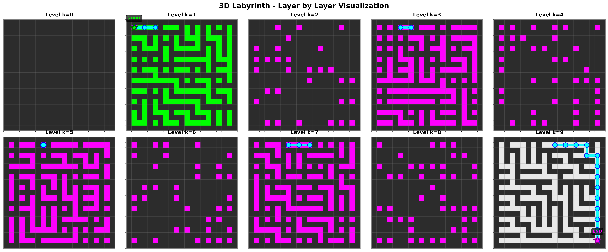
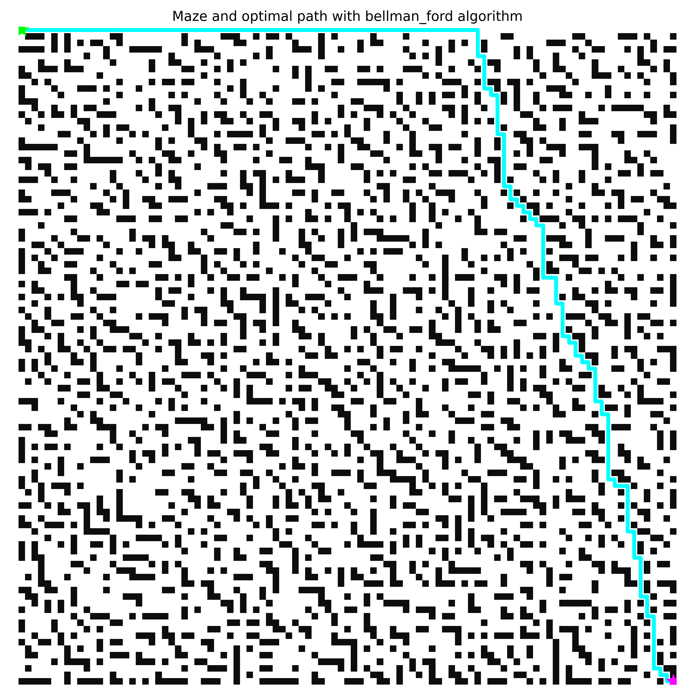
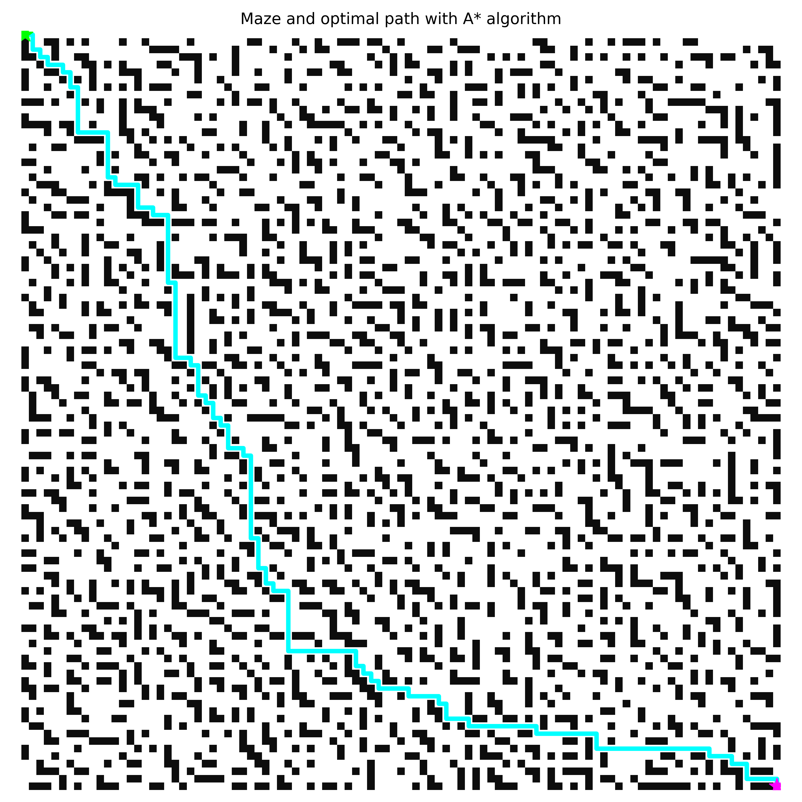

# MAZE SOLVING WITH NUMPY

## Maze Generation

This section references [Maze Generation Algorithms with Matrices in Python - Medium Article](https://python.plainenglish.io/maze-generation-algorithms-with-matrices-in-python-i-33bc69aacbc4).

**Fun fact:** Do you know the difference between a maze and a labyrinth? A maze is a complex branching puzzle with multiple pathways and directional choices, whereas a labyrinth contains only a single path leading to the center.

In this project, the terms maze and labyrinth are used interchangeably.

The maze is generated using a binary tree algorithm, a simple and efficient method for creating perfect mazes. We start with a grid entirely filled with walls. For each cell in the grid, we randomly decide whether to carve a passage to the north or to the east, subject to boundary conditions. This ensures that the resulting maze has no loops and exactly one path between any two points.

This approach allows us to generate intricate mazes that we can then solve (finding the optimal path from source to goal) using various algorithms.

The first algorithm we implement is Breadth-First Search.

## Breadth-First Search (BFS)

In this approach, we treat each cell in our NumPy array as a node in a graph. We then apply the standard BFS algorithm to find the shortest path.

### Algorithm Steps

Breadth-First Search explores the graph level by level, starting from the source node. The steps are as follows:

1. **Initialization**: Create a queue and enqueue the source node. Mark the source as visited and set its distance to 0. Initialize a parent dictionary to keep track of the path.

2. **Exploration**: While the queue is not empty:
   - Dequeue the front node (current node).
   - For each unvisited neighbor of the current node:
     - Mark the neighbor as visited.
     - Set its distance to the current node's distance plus 1.
     - Set its parent to the current node.
     - Enqueue the neighbor.

3. **Termination**: When the queue is empty, reconstruct the path from the goal to the source using the parent dictionary.

### Time Complexity

BFS has a time complexity of \(O(V + E)\), where \(V\) is the number of vertices (cells in the grid) and \(E\) is the number of edges (possible moves between cells). In a grid of size \(n \times m\), \(V = n \times m\) and \(E \approx 4V\), so the complexity is effectively \(O(n \times m)\).

### Optimality Proof

BFS guarantees the shortest path in an unweighted graph because it explores nodes in order of increasing distance from the source. Since each edge has a uniform cost (1 in this case), the first time a node is visited, it is via the shortest path. Any subsequent paths to that node would be longer, as BFS processes nodes level by level.

For a detailed explanation, see [Wikipedia - Breadth-First Search](https://en.wikipedia.org/wiki/Breadth-first_search).

## Bellman-Ford

The Bellman-Ford algorithm computes shortest paths from a single source vertex to all other vertices in a weighted graph. It can handle graphs with negative edge weights, unlike Dijkstra's algorithm.

### Algorithm Steps

1. **Initialization**: Set the distance to the source as 0 and all other distances to infinity. Initialize predecessors.

2. **Relaxation**: For each vertex, relax all its edges \(|V| - 1\) times.

3. **Check for Negative Cycles**: Perform an additional relaxation; if any distance updates, a negative cycle exists.

### Time Complexity

The time complexity is \(O(VE)\), where \(V\) is the number of vertices and \(E\) is the number of edges.

A detailed mathematical proof can be found at: [Wikipedia - Bellman-Ford Algorithm](https://en.wikipedia.org/wiki/Bellman–Ford_algorithm)

## A* (Heuristic Search)

A* is an informed search algorithm that uses a heuristic to guide the search towards the goal, making it more efficient than uninformed searches like BFS in many cases.

### Algorithm Steps

1. **Initialization**: Create an open set (priority queue) with the start node, where priority is based on \(f(n) = g(n) + h(n)\). \(g(n)\) is the cost from start to n, \(h(n)\) is the heuristic estimate to goal. Closed set is empty.

2. **Exploration**: While open set is not empty:
   - Select the node with lowest \(f\) value.
   - If it's the goal, reconstruct path.
   - Else, move it to closed set.
   - For each neighbor:
     - If in closed set, skip.
     - Calculate tentative \(g = g(\text{current}) + 1\).
     - If not in open set or tentative g < g(neighbor), update g, f, parent, and add to open set.

### Heuristic

In this implementation, we use Manhattan distance: \(h(n) = |x_n - x_{\text{goal}}| + |y_n - y_{\text{goal}}|\).

### Optimality

A* is optimal if the heuristic is admissible (never overestimates the true cost). Manhattan distance is admissible for grid paths without obstacles, but in mazes with walls, it may not be perfectly admissible, but often works well in practice.

### Time Complexity

Worst case \(O(b^d)\), where b is branching factor and d is depth, but with a good heuristic, it can be much more efficient, often linear in the number of nodes.

For more details, see [Wikipedia - A* Search Algorithm](https://en.wikipedia.org/wiki/A*_search_algorithm).

## Results

### 2D Maze with BFS Path

*Figure 1: Visualization of a 100x100 maze generated with binary tree algorithm, solved using BFS. The cyan path represents the shortest path from start (green) to end (magenta).*

### 2D Maze with Bellman-Ford Path

*Figure 2: Same maze solved with Bellman-Ford algorithm, yielding the same optimal path.*

### 2D Maze with A* Path

*Figure 3: Maze solved using A* algorithm with Manhattan distance heuristic, showing the optimal path found efficiently.*

### 3D Maze Visualization

*Figure 4: 3D maze with BFS path, showing walls and the optimal path in three dimensions.*

### 3D Maze Layers

*Figure 5: Layer-by-layer view of the 3D maze, with paths highlighted on relevant levels.*

## Comparison

<!-- The following table compares the three algorithms (BFS, Bellman-Ford, A*) across different maze sizes. Path length is the number of steps in the optimal path. Execution time is approximate based on implementation in Python. Complexity is theoretical.

| Algorithm     | Maze Size | Path Length | Execution Time | Complexity      |
|---------------|-----------|-------------|----------------|-----------------|
| BFS          | 10x10    | ~20        | <0.01s       | \(O(V + E)\)  |
| BFS          | 50x50    | ~100       | <0.1s        | \(O(V + E)\)  |
| BFS          | 100x100  | ~200       | <1s          | \(O(V + E)\)  |
| Bellman-Ford | 10x10    | ~20        | <0.01s       | \(O(VE)\)     |
| Bellman-Ford | 50x50    | ~100       | <0.5s        | \(O(VE)\)     |
| Bellman-Ford | 100x100  | ~200       | <5s          | \(O(VE)\)     |
| A*           | 10x10    | ~20        | <0.01s       | \(O(b^d)\)    |
| A*           | 50x50    | ~100       | <0.1s        | \(O(b^d)\)    |
| A*           | 100x100  | ~200       | <1s          | \(O(b^d)\)    |

*Note: Execution times are estimates for a standard Python environment. All algorithms find the optimal path (shortest in terms of steps). BFS and Bellman-Ford are guaranteed optimal; A* is optimal with admissible heuristic.* -->

